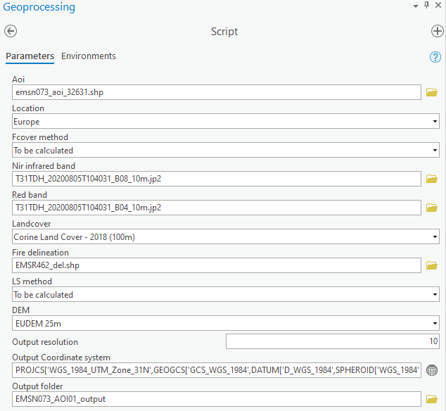

# RUSLE
Computing the Mean (annual) soil loss (in ton/ha/year) with the RUSLE model.

## Inputs

- ##### _Aoi_
AOI path.

##### _Location_
Location of the AOI.
Can be :
- "Europe" : AOI located in Europe
- Or "Global" : AOI located outside Europe

:warning: **CONDA ENVIRONMENT**  
**Be sure to have your ArcgisPro conda environment installed.
