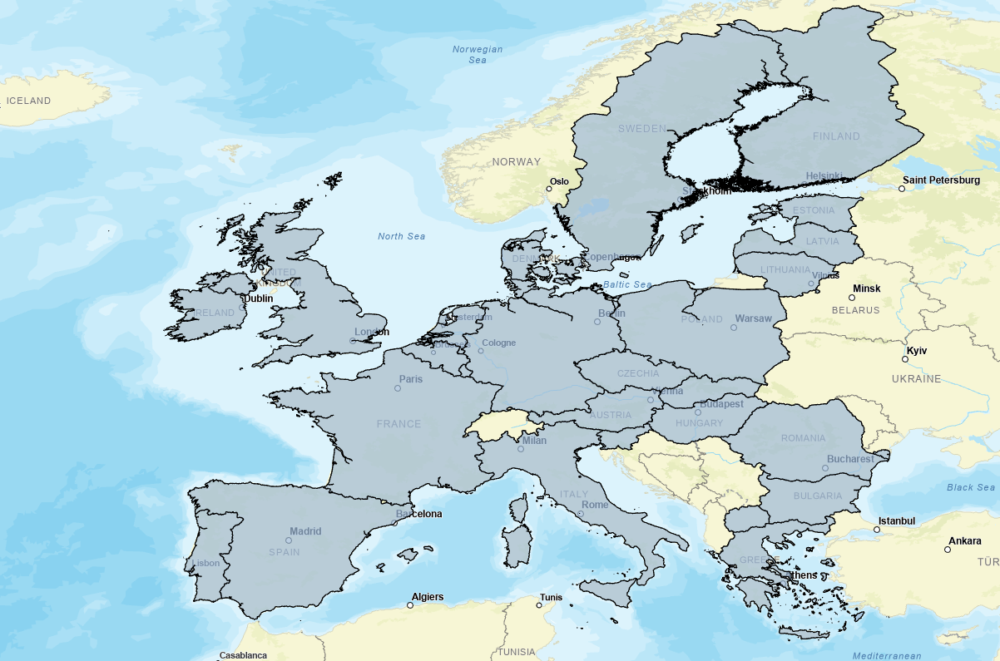

# RUSLE

:warning: **CONDA ENVIRONMENT**  
**Be sure to have your ArcgisPro conda environment installed.
See [here](https://git.unistra.fr/sertit/arcgis-pro/sertit-eo-conda-environment) for more information.**

## Description
Computing the Mean (annual) soil loss (in ton/ha/year) with the [RUSLE 2015 model](https://web.jrc.ec.europa.eu/policy-model-inventory/explore/models/model-rusle2015/).

> :information_source: The **Europe method** has some particularities for the computation of the **C** index which uses the c_arable_index over Europe, for which the datasets are defined based in the policy report [Soil-related indicators to support agri-environmental policies (EUR30090)](https://www.google.com/url?sa=t&source=web&rct=j&opi=89978449&url=https://publications.jrc.ec.europa.eu/repository/bitstream/JRC119220/jrc119220_agsol_deliverable2019_online_clean.pdf&ved=2ahUKEwivxoyHzciMAxXC8bsIHc1bIjYQFnoECBYQAQ&usg=AOvVaw11mZ2lQKQyysij3qH39dsF). Here there are stated only 27 countries from the EU, so **C** values with this parameter might lack the LULC information and will only rely on either the Fraction of green Vegetation Coverportal (Fcover) or Satellite Data depending on the availability.
The countries included in the computation of arable_c_index are:
* Austria, Belgium, Bulgaria, Cyprus, Czechia, Germany, Denmark, Estonia, Greece, Spain, Finland, France, Hungary, Ireland, Italy, Lithuania, Luxembourg, Latvia, Malta, Netherlands, Poland, Portugal, Romania, Sweden, Slovenia, Slovakia, United Kingdom, Czech Republic and the former Yugoslav Republic of Macedonia.
See below for an overview


> :information_source: **Global or European method?** The main cases where you might find a lack of data while applying the European method would be when one of the following countries are inside of your Area of Interest:
> * Andorra, Norway, Switzerland, Croatia, Serbia, Albania, Kosovo, Montenegro or even Bosnia and Herzegovina.

> Therefore, if the use of the LULC remains relevant for your calculations for the C index, the best option would be to choose the GLOBAL method.

## Arcgis pro inputs

### Basic inputs

**Aoi** (mandatory)

AOI path (shapefile, geojson, kml) or WKT strings.

**Location** (mandatory)

Location of the AOI.
Can be :
- "Europe" : AOI located in Europe
- Or "Global" : AOI located outside Europe

**Nir infrared band** and **Red band**

Path to the nir infrared and red bands to compute the Fraction of green Vegetation Coverportal (Fcover). 
You can provide your own Fcover raster in the advanced section.

**Output folder**

Path to the output folder.

### Advanced

Everything is optional in this section.

**Fcover**

You can provide an existing Fraction of green Vegetation Coverportal (Fcover) raster file.
If not provided, the Fcover is calculated  with the following formula :

```math
(NDVI - NDVI_s)/(NDVI_v - NDVI_s)
```

With :
- `NDVI` : Normalized Difference Vegetation Index
- `NDVI_s` : NDVI Min
- `NDVI_v` : NDVI Max

To produce it you will have to load a **NIR infrared band** and a **Red band** that cover the AOI.

**Landcover** (optional)

Name of the Landcover that will be used.
Can be :
- "Corine Land Cover - 2018 (100m)"
- "Global Land Cover - Copernicus 2019 (100m)"
- "P03" : P03 produce. The **"P03 raster"** need to be load . Should have the same values as CLC (need to be recode if not)

**Fire delineation** (optional)

Wildfire delineation path

Default: None

**LS Raster** (optional)

Optional path to the Slope angle and length (LS factor) raster. If not provided, it is calculated thanks to the DEM.

Default: None

**DEM** (optional)

The DEM is used if the LS raster is not provided.

Can be :
- "EUDEM 25m"
- "COPDEM 30m"
- "SRTM 30m"
- "MERIT 5 deg"
- "Other" : A DEM other than those listed above. Need to be load in the **"DEM raster"** parameter

Default: "COPDEM 30m"

**Output resolution** (Optional)

Resolution of the output raster in the unit of the output coordinate system. 

Default : 10 meters


## CLI

This tool is also usable by command line:
```shell
Usage: rusle [OPTIONS]

  Import osm charter with the CLI. Returns:

Options:
  -aoi, --aoi_path TEXT           Path to the AOI (shp, geojson) or WKT string
                                  [required]
  -loc, --location [Europe|Global]
                                  Location of the AOI  [required]
  -nir, --nir_path PATH           NIR band path needed if no fcover raster is
                                  provided.
  -red, --red_path PATH           RED band path needed if no fcover raster is
                                  provided.
  --satellite_product, --sat_product PATH
                                  Alternative to red and nir options. Path to
                                  a satellite product with at least the Nir
                                  and Red bands
  -lulc, --landcover_name [Corine Land Cover - 2018 (100m)|Global Land Cover - Copernicus 2019 (100m)|P03]
                                  Land Cover Name  [default: Global Land Cover
                                  - Copernicus 2019 (100m)]
  -fcp, --fcover_path PATH        Path to a Fraction of green Vegetation
                                  Coverportal (Fcover) raster file. If not
                                  provided, it will be calculated from nir and
                                  red bands or satellite products
  -p03, --p03_path PATH           P03 Path if lulc =  P03. Should have the
                                  same nomenclature as CLC
  -p03, -lsp, --ls_path PATH      Optional path to the Slope angle and length
                                  (LS factor) raster. If not provided, it is
                                  calculated thanks to the DEM.
  -del, --del_path PATH           Fire delineation path
  -dem, --dem_name [COPDEM 30m|EUDEM 25m|SRTM 30m|MERIT 5 deg|Other]
                                  DEM Name needed if ls_path option is not
                                  provided.  [default: COPDEM 30m]
  -demp, --other_dem_path PATH    DEM path if dem = Other
  -res, --output_resolution INTEGER RANGE
                                  Output resolution  [1<=x<=1000]
  -epsg, --epsg_code INTEGER RANGE
                                  EPSG code, 4326 is not accepted. By default,
                                  it is the EPSG code of the AOI UTM zone.
                                  [1024<=x<=32767]
  -o, --output DIRECTORY          Output directory.   [required]
  --ftep BOOLEAN                  Set this flag if the command line is run on
                                  the ftep platform.
  --help                          Show this message and exit.
```

Example:
```shell
conda activate arcgispro-eo
python rusle.py -aoi emsn073_aoi_32631.shp -loc "Europe" -nir T31TDH_20200805T104031_B08_10m.jp2 -red T31TDH_20200805T104031_B04_10m.jp2 -del emsn073_del_32631.shp -o output
```

# Licence 

Copyright (c) 2024 SERTIT, All rights reserved.

Licensed under The GNU General Public License version 3 (GPLv3) (the "License"); you may not use this file except in compliance with the License. You may obtain a copy of the License at https://www.gnu.org/licenses/gpl-3.0.html

Unless required by applicable law or agreed to in writing, software distributed under the License is distributed on an "AS IS" BASIS, WITHOUT WARRANTIES OR CONDITIONS OF ANY KIND, either express or implied. See the License for the specific language governing permissions and limitations under the License.
